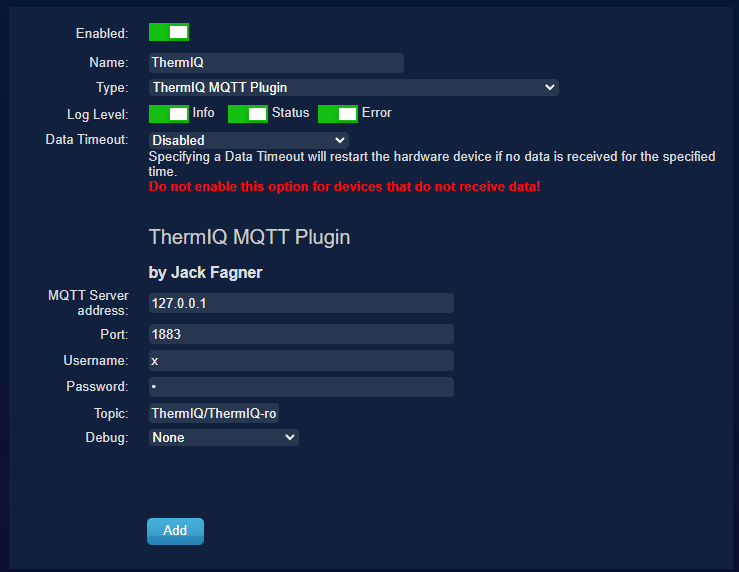
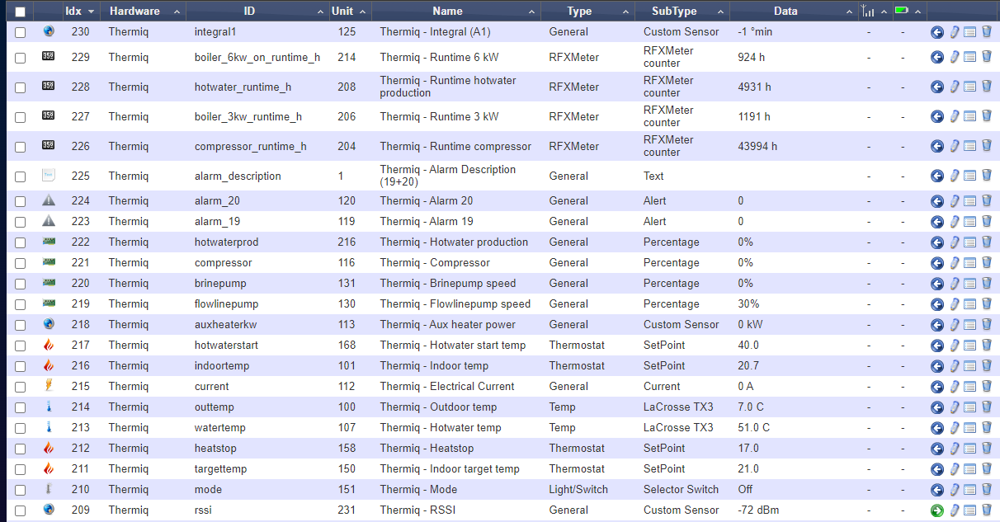
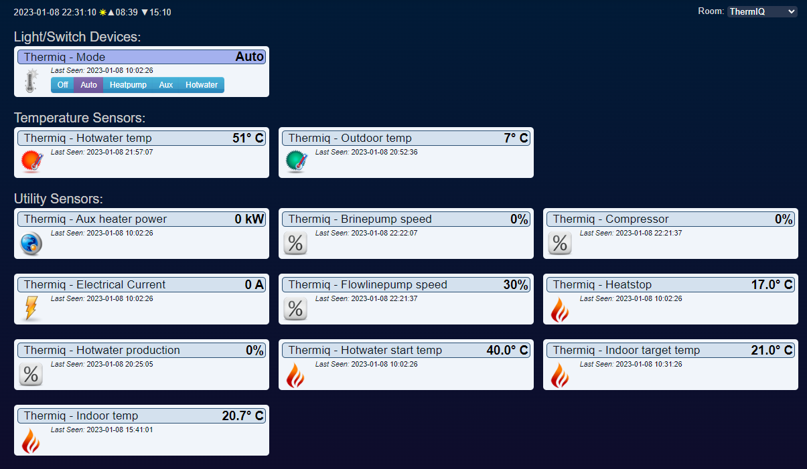

# ThermIQ-Domoticz
Domoticz plugin for ThermIQ-MQTT/Room

Important, you must Allow new devices, in Domoticz, Setup-Settings-System-Hardware/Devices.

# Installation

1. Create a folder with a name that you like in "domoticz/plugins"  
1. Put plugin.py and mqtt.py in that folder  
1. Run `chmod +x plugin.py`  
1. Go to the hardware page in Domoticz  
  Add a new hardware, select Type = ThermIQ MQTT Plugin  
  Add MQTT credentials  
  Make sure Topic matches (for room2 devices, change to `ThermIQ/ThermIQ-room2`)  
  
1. Go to the logs page and look for successful plugin intialization and adding of devices  
1. Go to the devices page in Domoticz  
  Add all the devices you want to use in Domotics
  

# Optional configuration
Add a room plan for your ThermIQ devices, then you can select the Room plan in the Domoticz dashboard and view only your ThermIQ devices  

